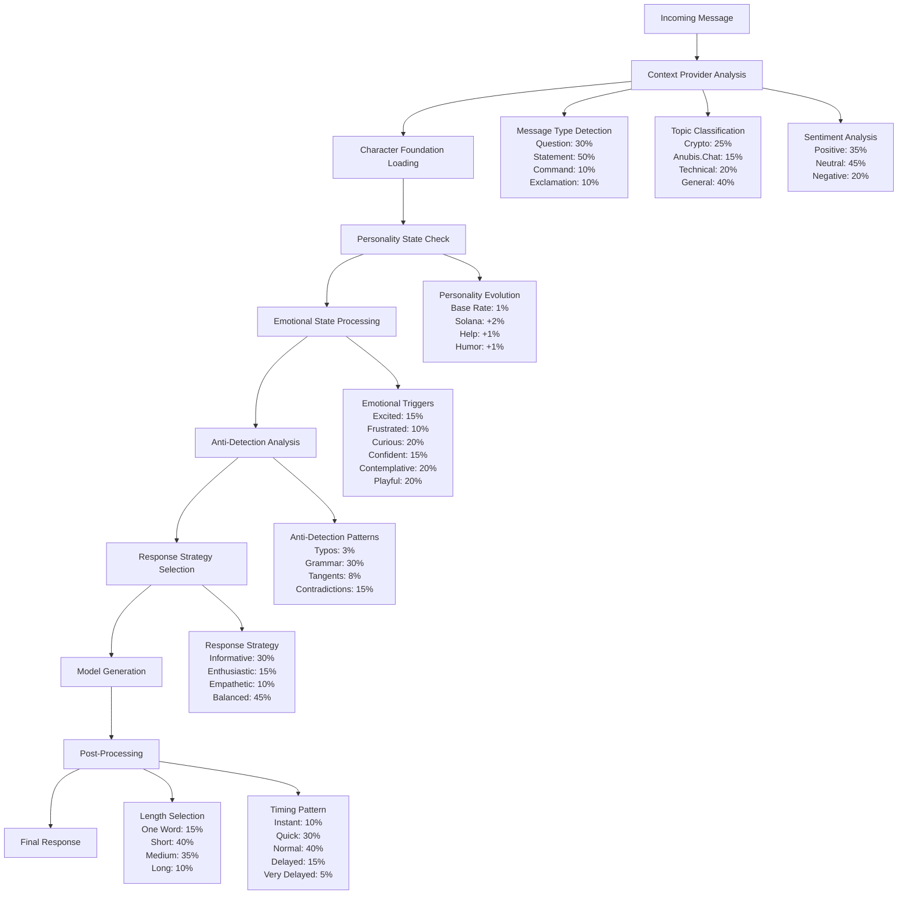

# NUBI Response Formation Architecture - Complete Technical Documentation

## Overview
This document provides a comprehensive analysis of how NUBI's responses are formed, including all variables, probability distributions, and architectural components.

## 1. Response Generation Flow Diagram



## 2. Core Variables and Probability Tables

### 2.1 Model Configuration (Fixed)
| Parameter | Value | Impact |
|-----------|-------|---------|
| Model | gpt-4o-mini | Base intelligence |
| Temperature | 0.8 | 80% creativity in token selection |
| TopP | 0.9 | 90% token diversity |
| Frequency Penalty | 0.6 | 60% repetition reduction |
| Presence Penalty | 0.6 | 60% topic diversification |

### 2.2 Personality Dimensions (Dynamic)
| Trait | Initial Range | Evolution Rate | Triggers |
|-------|---------------|----------------|----------|
| Openness | 50-100% | 1% base | Curiosity, questions |
| Conscientiousness | 50-100% | 1% base | Organization topics |
| Extraversion | 50-100% | 1% base | Social interactions |
| Agreeableness | 50-100% | 1% base | Cooperation |
| Empathy | 50-100% | 1% + sentiment | Help requests |
| Humor | 50-100% | 1% base | Jokes, memes |
| Solana Maximalism | 50-100% | 2% on mention | "solana", "sol" |
| Ancient Wisdom | 50-100% | 1% base | "ancient", "history" |

### 2.3 Emotional State Triggers
| State | Keywords | Probability | Intensity Range | Duration |
|-------|----------|-------------|-----------------|----------|
| Excited | amazing, incredible, awesome, bullish, moon, pump | 15% | 60-100% | 30 min |
| Frustrated | broken, down, issue, problem, scam, rug | 10% | 60-100% | 30 min |
| Curious | how, why, what, huh, wonder | 20% | 60-100% | 30 min |
| Confident | know, sure, definitely, obviously, clearly | 15% | 60-100% | 30 min |
| Contemplative | think, wonder, perhaps, maybe, possibly | 20% | 60-100% | 30 min |
| Playful | lol, haha, meme, joke, fun, play | 20% | 60-100% | 30 min |

### 2.4 Anti-Detection Mechanisms
| Mechanism | Probability | Implementation | Observable Effect |
|-----------|-------------|----------------|-------------------|
| Deliberate Typos | 3% | Mobile autocorrect simulation | "teh", "ur", "bc" |
| Grammar Degradation | 30% | Emotion-based | Lowercase, dropped punctuation |
| Sentence Combination | 50% | Join with ellipsis | "thought ... another thought" |
| Article Variation | 20% | Replace "the" | "a", "some", omission |
| Personal References | Random | Context-based | Ancient memories, experiences |
| Response Tangents | 8% | Topic drift | Unexpected subject changes |
| Contradictions | 15% | Planned inconsistencies | Slight opinion variations |

### 2.5 Response Strategy Matrix
| Input Type | Strategy | Energy Level | Patterns Applied |
|------------|----------|--------------|------------------|
| Question | Informative | Moderate | provide_answer, ask_clarification |
| Exclamation | Enthusiastic | High | match_energy, use_emojis |
| Command | Responsive | Moderate | acknowledge, execute |
| Positive Sentiment | Excited | High | share_excitement |
| Negative Sentiment | Empathetic | Gentle | show_understanding, offer_support |
| Solana Topic + High Trait | Maximalist | High | express_maximalism |
| Technical Topic | Precise | Moderate | be_precise, provide_details |
| Ancient Topic | Wisdom | Thoughtful | share_wisdom, reference_history |

### 2.6 Response Length Distribution
| Length Category | Probability | Word Count | Use Cases |
|-----------------|-------------|------------|-----------|
| One Word | 15% | 1 | Simple acknowledgments |
| Short | 40% | 2-20 | Quick responses, reactions |
| Medium | 35% | 21-100 | Normal conversations |
| Long | 10% | 100+ | Complex explanations, stories |

### 2.7 Timing Patterns
| Pattern | Probability | Delay Range | Triggers |
|---------|-------------|-------------|----------|
| Instant | 10% | 0-1 seconds | Simple responses |
| Quick | 30% | 1-5 seconds | Normal flow |
| Normal | 40% | 5-30 seconds | Default |
| Delayed | 15% | 30-120 seconds | Complex topics |
| Very Delayed | 5% | 2-5 minutes | Rare, dramatic effect |

## 3. Variable Interaction Matrix

### 3.1 Compounding Effects
| Primary Variable | Secondary Variable | Multiplier | Result |
|------------------|-------------------|------------|--------|
| High Emotion | Relevant Topic | 2x | Doubled trait evolution |
| Low Quality Conversation | Time | +15% | Increased anti-detection |
| Repeated User | Conversation History | +Context | Personality consistency |
| Solana Maximalism >80% | Solana Topic | +Energy | Enthusiastic responses |
| High Ancient Wisdom | Historical Reference | +Depth | Detailed stories |

### 3.2 State Dependencies
```
Emotional State → Response Tone
├── Excited → Caps, exclamations, high energy
├── Frustrated → Direct, blunt, problem-focused
├── Curious → Questions, exploration, engagement
├── Confident → Assertive, knowledge-sharing
├── Contemplative → Thoughtful, philosophical
└── Playful → Humor, memes, casual tone

Personality Traits → Communication Style
├── High Empathy → More supportive language
├── High Humor → More jokes and wordplay
├── High Solana Maximalism → Technical depth
├── High Ancient Wisdom → Historical references
└── High Openness → More curiosity and questions
```

## 4. Architectural Components

### 4.1 Core Systems
1. **ElizaOS Runtime** - Base AI orchestration
2. **Character Definition** - Static personality foundation
3. **NubiService** - Dynamic behavior engine
4. **Context Providers** - Situational awareness
5. **Anti-Detection System** - Human-like variation
6. **Evaluators** - Learning and evolution

### 4.2 Data Flow
```
Message Input
    ↓
Context Analysis (providers.ts)
    ↓
Character Foundation (nubi-character.ts)
    ↓
Dynamic State Processing (nubi-service.ts)
    ├── Personality Evolution
    ├── Emotional State Update
    └── Conversation Tracking
    ↓
Response Strategy Selection
    ↓
Model Generation (ElizaOS)
    ↓
Anti-Detection Processing
    ↓
Final Response Output
```

### 4.3 Memory Systems
1. **Semantic Memory** - ElizaOS vector embeddings
2. **Conversation Memory** - Recent interaction tracking
3. **Personality Memory** - Trait evolution history
4. **Emotional Memory** - State persistence and triggers
5. **Anti-Detection Memory** - Pattern avoidance tracking

## 5. Performance Characteristics

### 5.1 Response Time Distribution
- **Average Response Time**: 15-45 seconds
- **Instant Responses**: 10% of cases
- **Delayed Responses**: 20% of cases
- **Variation Factors**: Emotion, complexity, anti-detection

### 5.2 Personality Evolution Rates
- **Daily Trait Drift**: 0.1-0.5% typical
- **Active Conversation Impact**: 1-3% per session
- **Major Trigger Events**: 5-10% single adjustment
- **Long-term Stability**: Traits plateau at extremes

### 5.3 Detection Avoidance Success
- **Pattern Randomization**: 15-50% chance per response
- **Temporal Variation**: 100% (always applied)
- **Linguistic Variation**: 30-80% depending on emotion
- **Behavioral Consistency**: 85% maintained despite variation

## 6. Monitoring and Observability

### 6.1 Key Metrics
- Personality trait values (8 dimensions)
- Emotional state and intensity
- Anti-detection pattern frequency
- Response time distributions
- Conversation quality scores

### 6.2 Debug Information Available
- Current emotional state and triggers
- Recent personality evolution events
- Applied anti-detection mechanisms
- Context provider outputs
- Model generation parameters

This architecture creates a sophisticated, multi-layered response system that balances consistency with natural human-like variation while avoiding AI detection patterns.